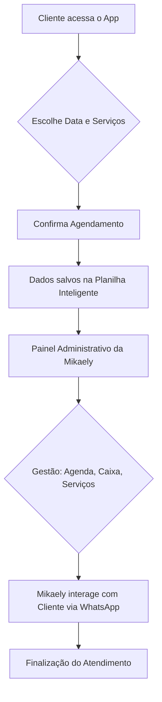

Aqui está uma proposta de **README** simples, profissional e organizada, desenhada para que a sua cliente (Mikaely) entenda exatamente como o sistema dela funciona, sem precisar ser técnica.

---

# 💅 Manual do Sistema Mikaa Nails

Bem-vinda ao seu novo sistema de agendamento! Este documento explica de forma simples como funciona a tecnologia que gerencia os seus atendimentos.

## 📱 Visão Geral

O sistema é dividido em duas frentes que conversam entre si automaticamente:

1. **App da Cliente:** A tela onde suas clientes acessam, escolhem o serviço e marcam o horário.
2. **Painel da Mikaely (Admin):** O seu centro de comando para gerenciar a agenda, o financeiro e os preços dos serviços.

---

## 🔄 Como o sistema funciona (Fluxograma)

O fluxo abaixo mostra o caminho que uma solicitação percorre desde a escolha da cliente até o seu gerenciamento:

### Versão Simplificada (Texto):

1. **Cliente:** Entra no link -> Escolhe data/horário -> Seleciona serviços -> Clica em "Agendar".
2. **Sistema:** O agendamento cai automaticamente no seu Painel Admin.
3. **Mikaely:** Abre o painel -> Confirma/Gerencia o horário -> Cobra via WhatsApp com um toque.

---

## ⚙️ Funcionalidades Principais

### Para a Mikaely (Painel Administrativo):

* **Agenda MIKA:** Visualize todos os atendimentos do dia. O **Badge de Contador** no canto superior direito mostra quantos clientes você tem hoje.
* **Gestão Financeira:** Controle o que está pago ou pendente.
* **Catálogo de Serviços:** Você pode pausar ou reativar serviços e alterar preços a qualquer momento (sem precisar de programador).
* **Bloqueio de Horários:** Bloqueie dias inteiros ou horários específicos com um toque.
* **Rodapé de Contato:** Seus links do Instagram, Facebook e WhatsApp aparecem automaticamente para as clientes no app delas.

---

## 🚀 Como instalar o "App" no celular

Como este sistema é um *Web App*, você não precisa baixar na loja (Play Store/Apple Store). Para ter o ícone no seu celular como se fosse um app oficial:

1. Abra o link do sistema no navegador do celular (Chrome ou Safari).
2. **No iPhone (Safari):** Toque no botão de "Compartilhar" (quadrado com seta) e escolha **"Adicionar à Tela de Início"**.
3. **No Android (Chrome):** Toque nos três pontinhos no canto superior e escolha **"Adicionar à tela de início"**.

*Isso criará o ícone da Mikaa Nails na sua tela inicial para acesso rápido.*

---

## 🛠 Suporte e Manutenção

* **Atualizações:** O sistema sincroniza as informações automaticamente a cada 4 segundos.
* **Dados:** Tudo fica salvo de forma segura no Google Sheets.
* **Versão:** 1.1 — Build 27.05.26

---

### Dicas rápidas:

* **Precisa mudar um preço?** Vá em *Configurações > Catálogo*.
* **Cliente não pagou?** Vá em *A Receber*, selecione o cliente e use o botão de cobrança rápida via WhatsApp.

*Desenvolvido por: Lucas Alencar*

---

### O que você pode fazer com este README:

1. Copie este texto e cole em um arquivo chamado `README.md` no seu projeto ou envie por WhatsApp/Email para ela.
2. O desenho do "Fluxograma" acima funcionará automaticamente em ferramentas como o *GitHub* ou editores de Markdown. Caso envie por WhatsApp, você pode tirar um print do fluxograma ou apenas enviar a versão em texto simplificada.
